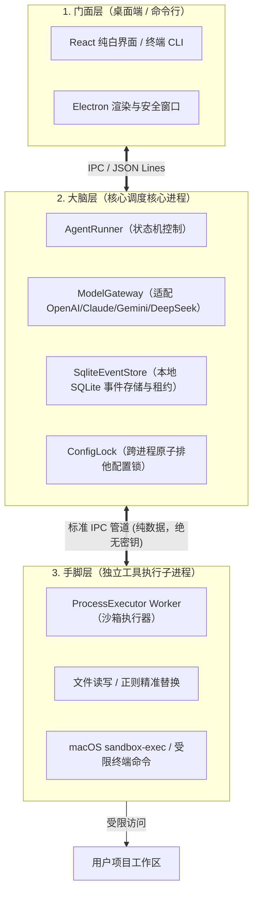
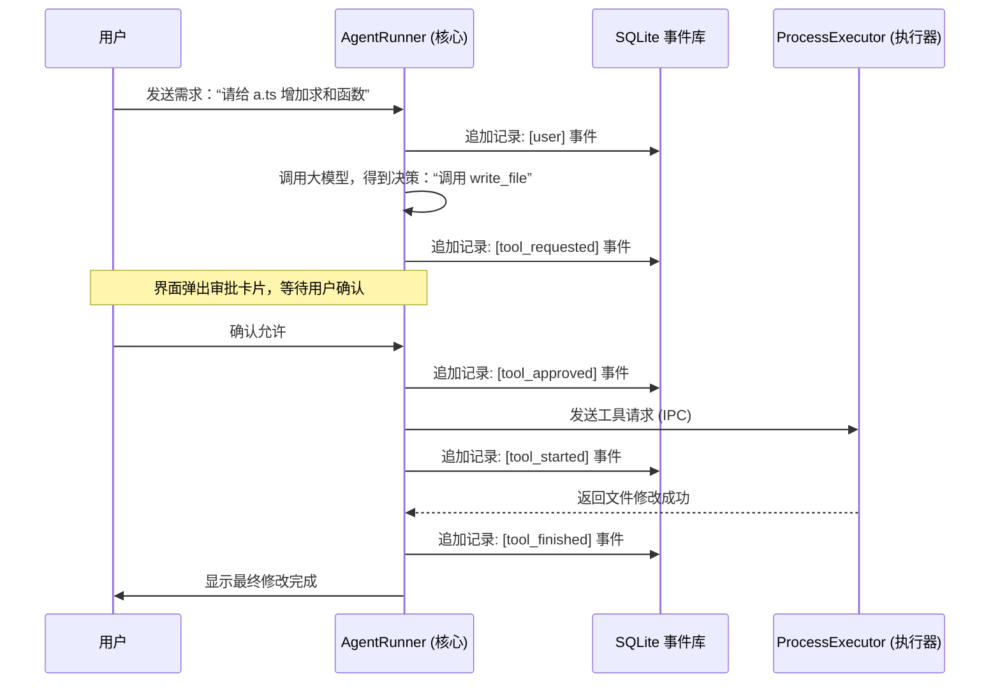
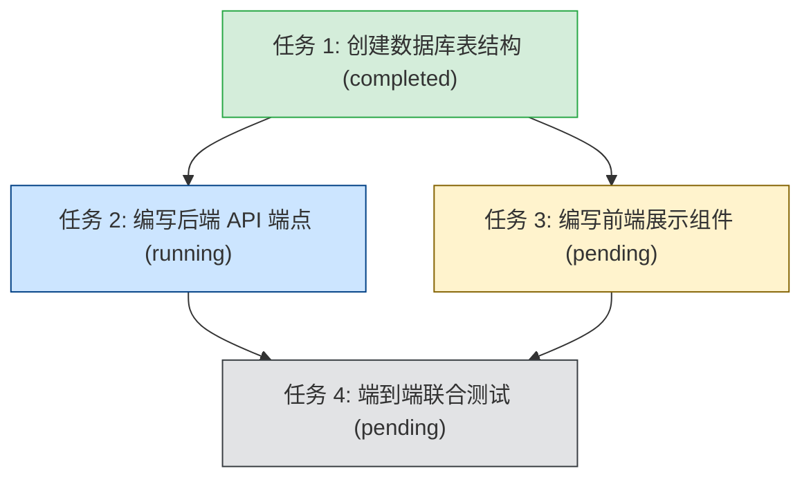

# 🐻 Bruin 深度拆解：通俗易懂的本地 AI 程序员助手指南

> **一句话认识 Bruin**：  
> Bruin 是一个运行在你**本地电脑**上的全栈 AI 编程助手（编码 Agent）。它既提供开箱即用的白净 Electron 桌面客户端，也提供极客喜爱的 CLI 命令行工具。它不仅能跟你聊天，还能像资深程序员一样**自主阅读项目代码、修改文件、运行终端命令、规划复杂多步任务**，并且全程具备**企业级安全沙箱与防崩溃机制**。

---

## 目录

1. [为什么需要 Bruin？它和网页聊天机器人有什么区别？](#一为什么需要-bruin它和网页聊天机器人有什么区别)
2. [总体架构：三层物理隔离（大脑、手脚与门面）](#二总体架构三层物理隔离大脑手脚与门面)
3. [核心机制一：永不丢失的记忆 —— SQLite 事件驱动与崩溃自愈](#三核心机制一永不丢失的记忆--sqlite-事件驱动与崩溃自愈)
4. [核心机制二：井井有条的工头 —— 复杂工作区任务图（Task DAG）](#四核心机制二井井有条的工头--复杂工作区任务图task-dag)
5. [核心机制三：真正的防翻车体系 —— 权限审批、原子写入与进程隔离](#五核心机制三真正的防翻车体系--权限审批原子写入与进程隔离)
6. [核心机制四：技能插件（Skills）与跨工具标准（MCP）](#六核心机制四技能插件skills与跨工具标准mcp)
7. [小白极速上手指南](#七小白极速上手指南)
8. [核心源码导读表](#八核心源码导读表)

---

## 一、为什么需要 Bruin？它和网页聊天机器人有什么区别？

如果你用过 ChatGPT、Claude 或通义千问的网页版，你一定遇到过这些痛点：

- ❌ **复制粘贴地狱**：要看代码，得把文件复制给它；改完代码，又得人肉复制回编辑器。
- ❌ **“金鱼脑”忘事**：稍微聊久一点，或者关掉浏览器标签，大模型就把之前的上下文和修改进度忘得一干二净。
- ❌ **满嘴跑火车**：模型生成了看似正确的命令，但实际一跑全是 Bug，因为它根本看不到真实的终端报错。

**Bruin 则是真正的自主智能体（Agent）：**

- ✅ **拥有真实的手脚**：它直接对接你的项目文件夹，自己读文件、搜代码、跑测试、看报错并自动修复。
- ✅ **极度重视安全**：写文件、删目录、跑危险 Shell 命令**必须先经过你的审批**，绝不会在背后搞破坏。
- ✅ **企业级可靠**：每一轮思考、每个工具调用的结果都会实时落盘存储到本地数据库，即使电脑断电、程序崩溃，重启后也能准确接续进度。

---

## 二、总体架构：三层物理隔离（大脑、手脚与门面）

在开发 Agent 时，新手最容易犯的错误是：“把所有逻辑写在一个进程里，大模型想执行什么命令就直接 `child_process.exec()`”。这极其危险——一旦模型遭遇 Prompt 注入攻击，黑客可以直接盗取你的 API Key，甚至格式化你的电脑！

Bruin 采用了优雅的**三层物理进程隔离架构**：



### 为什么必须这样拆分？

1. **秘密绝不泄露**：
   `ModelGateway` 掌握你的大模型 API Key，驻留在大脑核心进程中。而具体在终端里敲命令的 `ProcessExecutor` 子进程，**在环境变量中彻底剥离了 API 密钥**。即使恶意脚本在命令行执行 `env`，也休想偷走密钥。
2. **手脚骨折不影响大脑思考**：
   如果某个 Shell 命令死循环、内存泄露（OOM）或者被系统杀掉，挂掉的只是手脚子进程。大脑感知到之后，会**毫秒级自动拉起一个全新的 Worker 子进程**，核心业务逻辑与对话状态稳如泰山。

---

## 三、核心机制一：永不丢失的记忆 —— SQLite 事件驱动与崩溃自愈

很多玩具级 Agent 内部仅仅用一个内存数组 `const messages = []` 存对话。一旦进程闪退，之前发生的所有操作全部灰飞烟灭。

Bruin 借鉴了分布式系统中的**事件溯源（Event Sourcing）**思想，所有状态的变更均由一条条不可篡改的事件组成：



### 生产级容灾亮点：

- **30 秒互斥租约锁（Lease）**：
  在 `SqliteEventStore` 中，会话在运行时必须原子争抢 30 秒的租约并定时心跳续期。这杜绝了“桌面端开着会话，命令行里又开同一个会话并发写入导致数据打架”的灾难。
- **副作用未知（`tool_unknown`）防御**：
  想象一下：模型正在发起“扣费 API”或“文件覆写”，命令发出去的一刹那电脑突然断电！
  下次开机后，很多 Agent 会自作聪明地重新执行一次——这会导致重复扣费或覆盖丢失。Bruin 的崩溃扫描器在重启时，若发现某个调用停在 `tool_started` 且没有 `tool_finished`，会**主动记为 `tool_unknown` 并暂停**，提示人类：“上一次操作结果未知，请人工确认当前工作区后继续”。

---

## 四、核心机制二：井井有条的工头 —— 复杂工作区任务图（Task DAG）

面对大工程时，普通 Agent 经常“走一步看一步”，改到第 5 个文件就忘记了最初的规划。Bruin 实现了独立于对话上下文的**工作区持久化任务依赖图（Task Graph）**：



1. **DAG 依赖与成环检测**：
   任务之间可以声明 `blockedBy`（前置依赖）。只有上游任务都变为 `completed`，下游任务才能被认领开始。在动态增加依赖时，系统使用深度优先遍历进行**有向无环图（DAG）环路检测**，防止出现“A 等 B，B 又等 A”的逻辑死锁。
2. **SQLite 权威事务原子认领**：
   多个子 Agent 或多窗口协作时，谁去干哪个活？Bruin 在 SQLite 单一事务内完成“检查无依赖阻塞 + 占用认领 + 绑定 Owner 租约”，绝不会两个人抢同一个任务。
3. **人类友好的工作区快照**：
   每次任务变更，系统会自动在项目根目录的 `.tasks/<id>.json` 生成可读的快照文件。人类开发者直接用 VS Code 就能像看 Jira 看板一样查看任务进度。

---

## 五、核心机制三：真正的防翻车体系 —— 权限审批、原子写入与进程隔离

在真实代码仓库中运行 Agent，最可怕的是把代码改坏、写丢或者发生未预期的删库行为。Bruin 从四个维度构筑了铜墙铁壁：

### 1. 严格的路径越界封锁

很多恶意注入攻击喜欢利用 `../../` 试图读取系统的 `/etc/passwd` 或 `~/.ssh/id_rsa`。
Bruin 在底层使用规范化绝对路径解析与 `O_NOFOLLOW` 规则，只要检测到请求路径不在当前项目工作区根目录下，或属于恶意的软链接逃逸，**一律直接拦截报错**。

### 2. 原子安全写入（Shadow Write）

传统写入是一旦中途报错（磁盘满、被中断），文件就会变成损坏的半截空文件。
Bruin 的 `src/executor/worker.ts` 在写文件时：

1. 先在目标目录生成随机后缀的隐藏临时文件；
2. 将完整内容写完并落盘；
3. 保留原文件的 POSIX 权限（如 `0755` 保持可执行状态）；
4. 通过原子系统调用 `fs.renameSync` 瞬时替换目标文件。中途哪怕拔电源，原文件也绝不受损。

### 3. 多进程配置文件并发锁（`withConfigLock`）

当桌面端设置页面在修改 MCP 服务器，同时命令行里又在添加模型配置时，常规文件写入会发生经典竞态覆盖。
Bruin 在 `src/config.ts` 中实现了跨进程的排他文件锁：

- 基于操作系统底层的 `O_CREAT | O_EXCL` 原子排他创建；
- 支持同进程内的安全**可重入递归加锁**；
- 具备**陈旧死锁自动嗅探**（如果持有锁的进程崩溃退出超过 10 秒，后续进程会自动探测并接管死锁，保证系统永不死锁）。

---

## 六、核心机制四：技能插件（Skills）与跨工具标准（MCP）

除了自带的文件读写和终端命令，Bruin 还是一个高度可扩展的开放平台：

### 1. 技能系统（Skills）

遵循标准 `SKILL.md` 规范。你可以在全局 `~/.bruin/skills/` 或项目目录中放置专门的提示词与流程模板（如自带的 `plan`、`debug`、`code-review`、`test`）。Agent 会在需要时按需检索并加载进上下文，不会无休止地浪费你的 Token。

### 2. MCP 协议支持（Model Context Protocol）

Bruin 原生兼容 Anthropic 主导的开放工具协议 MCP：

- **stdio 模式**：通过管道拉起本地外部工具进程；
- **Streamable HTTP 模式**：连接远程工具服务器（生产级强制要求 HTTPS，杜绝明文泄露）。
  所有接入 MCP 的工具，调用前同样受到 Bruin 统一的审批流和日志审计监管。

---

## 七、小白极速上手指南

### 1. 环境准备

确保你的电脑上安装了：

- **Node.js**: v22.12 或更高版本
- **Git**
- **ripgrep**（全局高速搜索工具，Mac 用户推荐 `brew install ripgrep`）

### 2. 启动桌面端（开箱即用体验最好）

```bash
# 克隆仓库并安装依赖
git clone https://github.com/MichaelAbel1/Bruin.git
cd Bruin
npm ci

# 启动全白极简风格的桌面客户端
npm run desktop:dev
```

_启动后，在右上角「设置 -> 模型设置」中输入你的 API Key（支持 OpenAI、Claude、Gemini 以及任何 OpenAI 兼容网关，例如 DeepSeek、Ollama 等）。_

### 3. 极客推荐：CLI 命令行直接对话

```bash
# 编译源码
npm run build

# 配置模型
export OPENAI_API_KEY='sk-your-key-here'
node dist/cli.js model add my-gpt openai gpt-4o

# 指定某个项目目录开始对话
node dist/cli.js chat --model my-gpt --workspace /Users/yourname/my-cool-project
```

---

## 八、核心源码导读表

如果你想深入研读代码，这里是全库最重要的几个入口：

| 模块名称             | 源代码位置                   | 核心职责                                                        |
| :------------------- | :--------------------------- | :-------------------------------------------------------------- |
| **智能体状态机**     | `src/core/agent.ts`          | 调度循环、大模型流式调用、工具审批与未知异常防线                |
| **事件库与任务图**   | `src/storage/event-store.ts` | SQLite 事件溯源、30秒租约管理、Task DAG 任务图与 Cron 调度      |
| **隔离执行器客户端** | `src/executor/client.ts`     | 管理 Worker 子进程生命周期、消除多进程退出与重启竞态            |
| **沙箱工作进程**     | `src/executor/worker.ts`     | 无秘钥执行环境、路径防越界、原子覆写与受限 Shell                |
| **多模型网关**       | `src/providers/gateway.ts`   | 抹平 OpenAI / Claude / Gemini / 兼容格式的流式与工具调用差异    |
| **并发锁与配置**     | `src/config.ts`              | 跨进程排他文件锁 `withConfigLock` 与配置原子更新 `updateConfig` |
| **桌面桥接中枢**     | `src/desktop-host.ts`        | 连接 Electron 主进程与后端核心，处理会话列表与持久化服务        |
